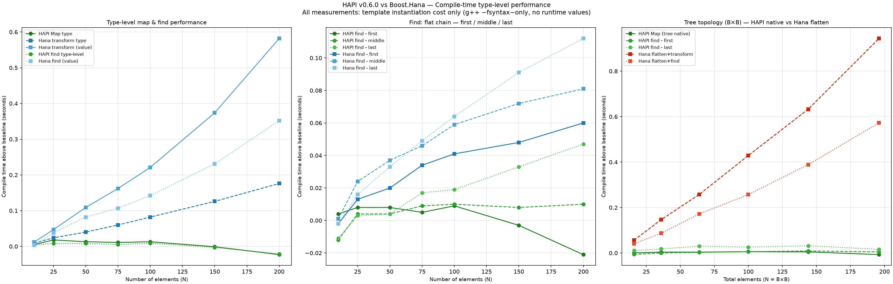

#  HAPI — Happy API

[](https://opensource.org/licenses/MIT)
[](https://registry.platformio.org/libraries/neu-rah/HAPI) <a href="https://www.paypal.me/ruihfazevedo" rel="nofollow"></a>

**Static, incremental composition for C++17.**

HAPI is a small C++ library for composing components incrementally at the type level.

A component defines a `Part<O>` that derives from `O`. A `Chain` applies those components recursively, while `APIOf` supplies the final base API.

The result is an ordinary C++ type. HAPI does not require a runtime composition framework.

---

## A simple example

The following is based on the composition pattern used by HAPI's compile-time tests.

```cpp
#include <hapi/hapi.h>
using namespace hapi;

template<typename Cfg=Nil>
struct ItemAPI : Cfg {
  template<typename Out>
  static constexpr void print(Out& out) { out << "/"; }
};

template<typename... OO>
struct ItemDef : APIOf<ItemAPI<>, OO...> {
  using Base=APIOf<ItemAPI<>,OO...>;
  using Base::Base;
  static constexpr const size_t size{sizeof...(OO)};
};

struct A {
  template<typename O>
  struct Part : O {
    using Base=O;
    using Base::Base;

    template<typename Out>
    static constexpr void print(Out& out) {
      out << "/A";
      Base::print(out);
    }
  };
};

struct B {
  template<typename O>
  struct Part : O {
    using Base=O;
    using Base::Base;

    template<typename Out>
    static constexpr void print(Out& out) {
      out << "/B";
      Base::print(out);
    }
  };
};

constexpr ItemDef<A,B> item{};
```

`APIOf<ItemAPI<>,A,B>` closes the composition by supplying `ItemAPI<>` as the base. The resulting type is built through the `Part<O>` transformations supplied by `A` and `B`.

---

## The central idea

A HAPI component is an **open type transformation**:

```cpp
struct A {
  template<typename O>
  struct Part : O {
    using Base=O;
    using Base::Base;
  };
};
```

The component does not decide what its final base type will be.

A chain can therefore be formed independently:

```cpp
using C = Chain<A,B>;
```

and applied to a base later:

```cpp
using T = C::Part<ItemAPI<>>;
```

`APIOf` provides the convenient form for closing that composition:

```cpp
using T = APIOf<ItemAPI<>,A,B>;
```

For `Chain<A,B>`, the recursive `Part` definition produces the equivalent inheritance structure:

```cpp
A::Part<
  B::Part<
    ItemAPI<>
  >
>
```

This is the basic mechanism behind HAPI's incremental composition model.

---

## Incremental composition

A `Chain` is itself a component, so a chain can be used as part of another chain.

```cpp
using AB = Chain<A,B>;

using ABC = Chain<AB,C>;
```

The nested structure remains part of the type:

```cpp
using T = ABC::Part<ItemAPI<>>;
```

This is useful when larger compositions are assembled from smaller, reusable compositions.

The important point is that the intermediate composition does not have to be flattened into a separate representation before it can be composed again. `Chain` exposes its own `Part<T>` and therefore participates in the same composition mechanism as the other components.

---

## Incremental API

Because the composition folds through ordinary inheritance, each component's `Part<O>` sees the accumulated API of everything composed before it, as `O`. That gives every component two independent options for any given function:

* **contribute** a function that did not exist in `O`
* **override** a function that already exists in `O`, and call `Base::` to reach the version supplied by the components before it

The `print` example above already does the second: `A::Part` and `B::Part` both override `print`, and both call `Base::print(out)` to reach the implementation contributed further down the chain.

A component can just as easily add something new instead:

```cpp
struct C {
  template<typename O>
  struct Part : O {
    using Base=O;
    using Base::Base;

    static constexpr int extra() { return 42; }
  };
};

using WithC = APIOf<ItemAPI<>,A,B,C>;

static_assert(WithC{}.extra() == 42);
```

`extra` did not exist in `ItemAPI`, `A`, or `B`. `C` introduces it, and it becomes part of the resulting type's API exactly as if it had been declared there directly.

Because this is ordinary inheritance, the two cases are not mutually exclusive within a single component: a `Part<O>` can override some of `O`'s functions while contributing others. The choice is made per function, not per component.

---

## Type-tree operations

HAPI's compile-time operations operate on `Chain` structures.

For example, a chain can be mapped using a type transformation:

```cpp
template<typename O>
struct Identity {
  using Type=O;
};

using Input = Chain<A,B>;
using Output = Map<Identity>::Check<Input>;

static_assert(std::is_same_v<Output,Chain<A,B>>);
```

`Map` rebuilds a `Chain` from the transformed elements. Nested `Chain`s are traversed by the common `Traverse` mechanism.

A filter can select elements while producing another `Chain`:

```cpp
using Input = Chain<A,B>;

using OnlyA = Filter<SameAs<A>>::Check<Input>;

static_assert(std::is_same_v<OnlyA,Chain<A>>);
```

`Filter` uses the predicate at the element level and concatenates the resulting `Chain` fragments.

---

## Compile-time queries

The simplest query is `query`:

```cpp
static_assert(query<SameAs<A>,A>);
static_assert(query<SameAs<A>,Chain<A>>);
static_assert(!query<SameAs<B>,Chain<A>>);
```

`SameAs<T>` is a predicate whose `Apply` checks `std::is_same<T,O>`.

Presence can also be checked directly:

```cpp
using Input = Chain<A,B>;

static_assert(Exists<SameAs<A>,Input>);
static_assert(Exists<SameAs<B>,Input>);
static_assert(!Exists<SameAs<int>,Input>);
```

`Exists` is the non-failing presence query: it produces a boolean result rather than requiring a successful match.

---

## FindFirst

`FindFirst` resolves the first matching type in a chain.

```cpp
using Input = Chain<A,B>;

using Found = FindFirst<SameAs<A>>::Check<Input>;

static_assert(std::is_same_v<Found,A>);
```

A missing match is deliberately a compile-time failure:

```cpp
// using Missing = FindFirst<SameAs<int>>::Check<Input>;
```

The implementation short-circuits at the first successful match rather than continuing through the remaining elements.

For a non-failing query, `FindFirstOr` supplies a default:

```cpp
using Input = Chain<A,B>;

using Found = FindFirstOr<SameAs<A>,Nil>::Check<Input>;
using Missing = FindFirstOr<SameAs<int>,Nil>::Check<Input>;

static_assert(std::is_same_v<Found,A>);
static_assert(std::is_same_v<Missing,Nil>);
```

---

## Querying an object's type structure

`APIOf` exposes the resulting composition through `Types`.

```cpp
using Item = ItemDef<A,B>;

static_assert(query<SameAs<A>,typename Item::Types>);
static_assert(query<SameAs<B>,typename Item::Types>);
```

`FromTypes<Q>` provides a predicate for types that expose a `Types` member:

```cpp
using Item = ItemDef<A,B>;

static_assert(
  FromTypes<SameAs<A>>::Apply<Item>::value
);

static_assert(
  !FromTypes<SameAs<int>>::Apply<Item>::value
);
```

This lets compile-time queries distinguish between the object/type being inspected and its exposed composition structure.

---

## Runtime resolution

HAPI also provides `find<Q>(object)`.

The current implementation uses the object's `Types` member to perform a compile-time `FindFirst` check and then returns the object reference:

```cpp
ItemDef<A,B> item;

auto& result = find<SameAs<A>>(item);

static_assert(
  std::is_same_v<
    decltype(result),
    ItemDef<A,B>&
  >
);
```

The important distinction is that the **query is compile-time**, while the returned reference is an ordinary runtime reference to the composed object. `find` does not construct a runtime component registry or perform a dynamic search.

---

## Type-level validation

Components can provide `rules()` to constrain how they may appear in a composition.

This is the actual pattern used by HAPI's compile-time tests:

```cpp
struct A {
  template<typename O>
  struct Part : O {
    using Base=O;
    using Base::Base;
  };
};

struct B {
  template<typename O>
  struct Part : O {
    using Base=O;
    using Base::Base;
  };

  template<typename Before,typename After>
  static constexpr bool rules() {
    static_assert(
      query<SameAs<A>,Before>,
      "B only makes sense after A"
    );

    static_assert(
      !query<SameAs<B>,After>,
      "do not repeat B"
    );

    static_assert(
      !query<SameAs<A>,After>,
      "A must be before B"
    );

    return true;
  }
};
```

A valid composition:

```cpp
constexpr ItemDef<A,B> ok{};
```

An invalid composition can therefore fail during compilation:

```cpp
// constexpr ItemDef<B> fail_requireA{};
// constexpr ItemDef<B,A> fail_order{};
// constexpr ItemDef<A,B,B> fail_unicity{};
```

`APIOf` invokes `BuildRules` when the composition is closed, causing the rules to be evaluated as part of the type construction.

---

## Runtime characteristics

HAPI's composition mechanism does not require:

* virtual dispatch
* dynamic allocation
* a runtime component registry
* runtime composition metadata

The goal is not to claim that every generated program is automatically optimal.

The goal is to make **composition itself a compile-time property**, using ordinary C++ types and inheritance.

Generated code remains subject to the compiler, optimization settings, target architecture, and the implementation of the composed components.

---

## Compile-time cost

Template-heavy C++ can make compile-time cost an important part of library design.

This was treated as a specific design concern during HAPI's development.

Rather than assuming that static composition would remain inexpensive, HAPI's compile-time operations were measured and compared with established C++ template libraries.

### Benchmark



The benchmark compares selected HAPI operations with Boost.Hana.

The measurements use:

```text
g++ -fsyntax-only
```

and measure compile-time behavior without executing runtime values.

The comparison is **not intended as a general performance ranking between the libraries**. They have different purposes and different abstractions.

Boost.Hana is used as a well-known C++ metaprogramming reference point.

The purpose of the benchmark is straightforward:

**compile-time cost was treated as a design constraint and measured during development.**

The benchmark checks how the type-level operations behave as the number of elements grows, including comparisons involving nested tree topology.

---

## HAPI and Boost.Hana

HAPI and Boost.Hana are complementary.

Boost.Hana provides a broad framework for heterogeneous compile-time and value-level computation.

HAPI focuses on **incremental structural composition through C++ types and recursive inheritance**.

The benchmark uses Boost.Hana as a familiar reference point for compile-time behavior. It is not intended to claim that HAPI replaces Hana, or that either library is generally faster.

The comparison was made because compile-time cost matters for a template-based C++ library, and Hana provides a useful established reference for that concern.

---

## General-purpose C++

The composition mechanism itself never touches hardware. `Chain<>`'s fold
(`hapi/chain.h`) is plain recursive inheritance, and `hapi/base.h` only
branches for AVR/no-STL freestanding toolchains — everywhere else it's
ordinary `<cstddef>`/`<type_traits>`/`<utility>`. OneData, one of the
libraries built on HAPI, states this directly: "Tested on AVR (avr-gcc 7+)
and x86-64" — the same composed types run identically on a hosted target.

The compile-time-cost discipline described above isn't an embedded-only
concern either — it benefits any C++17 codebase using heavy template
composition, not only firmware.

OneParse, another library built on HAPI, already benchmarks its
runtime parsing throughput against desktop parsing libraries — lexy, PEGTL,
simdjson, rapidjson, and Boost.Spirit.X3 — on JSON fixtures (see
`OneParse/benchmark/`), independent of any embedded target.

[`examples/config_loader`](examples/config_loader) is the first example
that combines HAPI, OneData, and OneParse together outside the embedded
framing: a small CLI config loader/validator, built as an ordinary
PlatformIO `env:native` target with no board and no embedded framework.

---

## C++17 and embedded systems

HAPI is written for C++17 and is intended for systems where static composition is useful.

The repository includes examples for different environments, including embedded and HLS-oriented experiments. The examples directory currently contains `crtp`, `free`, `godbolt`, `rules`, `std`, `virt`, several HLS examples, and a non-embedded cross-library demonstrator (`config_loader`).

The composition model can be used for applications such as:

* hardware interfaces
* protocol stacks
* parsers
* input/output components
* processing pipelines
* validation structures

---

## Hardware synthesis

The repository contains HLS experiments, including `hls_can_disabler`, `hls_fir`, and `hls_smoke`.

Selected HAPI compositions have also been tested with **PandA-Bambu HLS**.

This is an experimental application of the static composition model. It is not a claim that arbitrary HAPI programs are automatically synthesizable.

See [Industry Applications](docs/INDUSTRY.md).

---

## Documentation

* **[Industry Applications](docs/INDUSTRY.md)** — Applications of the composition model.
* **[Component Architecture](docs/COMPONENTS.md)** — Component anatomy and layer structure.
* **[API Reference](docs/REFERENCE.md)** — Core types and advanced usage.
* **[Compile-time tests](tests/compile_tests.cpp)** — Compile-time validation examples.
* **[Benchmarks](benchmark/)** — Compile-time measurements and experiments.

---

## Related projects

HAPI is the foundation for the **One*** library family in [InternetOfPins](https://github.com/InternetOfPins):

| Project                                                  | Description                    |
| -------------------------------------------------------- | ------------------------------ |
| [OneBit](https://github.com/InternetOfPins/OneBit)       | Bit manipulation               |
| [OneData](https://github.com/InternetOfPins/OneData)     | Data components                |
| [OnePin](https://github.com/InternetOfPins/OnePin)       | Pin and port abstractions      |
| [OneChip](https://github.com/InternetOfPins/OneChip)     | Hardware register components   |
| [OneBus](https://github.com/InternetOfPins/OneBus)       | Bus protocols                  |
| [OneIO](https://github.com/InternetOfPins/OneIO)         | Physical I/O components        |
| [OneInput](https://github.com/InternetOfPins/OneInput)   | Composable physical input      |
| [OneSensor](https://github.com/InternetOfPins/OneSensor) | Sensor components              |
| [OneItem](https://github.com/InternetOfPins/OneItem)     | Item behavior and presentation |
| [OneOutput](https://github.com/InternetOfPins/OneOutput) | Output components              |
| [OneMenu](https://github.com/InternetOfPins/OneMenu)     | Menu system                    |
| [OneParse](https://github.com/InternetOfPins/OneParse)   | Parser components              |

---

## Status

HAPI is an experimental C++ composition library under active development.

The central design question is how far **incremental, type-level composition through open recursive inheritance** can be taken while retaining practical compile-time costs and useful generated programs.

The repository contains the implementation, examples, tests, benchmarks, and experiments used to explore that model.

---

*Made with obsession in the Azores* 🇵🇹

By [Rui Azevedo](https://github.com/neu-rah) · [@ruihfazevedo](https://x.com/ruihfazevedo)
